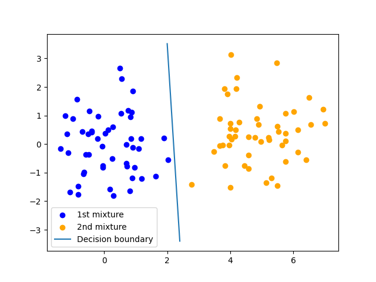
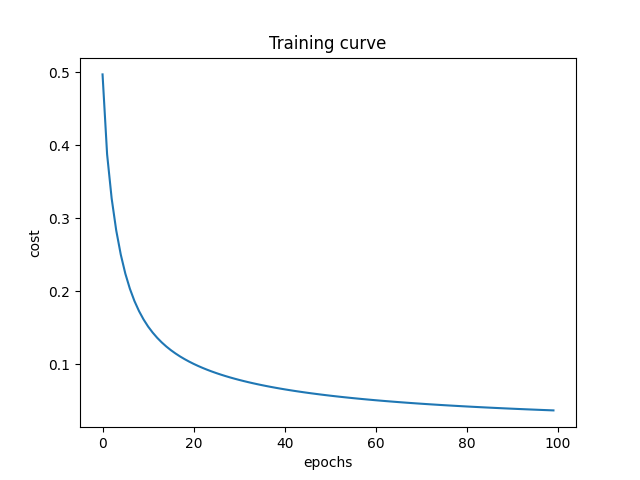

# Probabilistic Discriminative Modelling with Logistic Regression

This repository contains the code for logistic regression with stochastic gradient descent




## How to run
1) Install the Python modules in ```requirements.txt```
2) Run the Jupyter Notebook